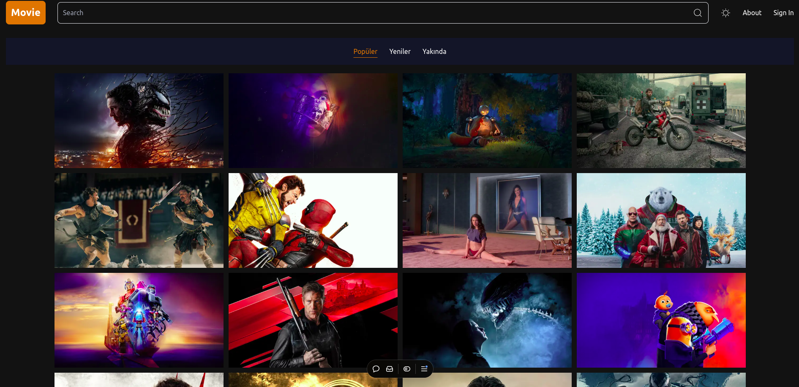

# Movie Explorer

Movie Explorer is a movie browsing application built with **Next.js**. It allows users to search for popular, upcoming, and trending movies. The app uses **The Movie Database (TMDb) API** to fetch movie data, and it features a responsive design powered by **Tailwind CSS**.

You can access the live app here: [Movie Explorer](https://movie-explorer-pk9q-9cxnya1h7-uyanikislams-projects.vercel.app)

## Project Information

| Key              | Details                                                                          |
| ---------------- | -------------------------------------------------------------------------------- |
| **Project Name** | Movie Explorer                                                                   |
| **Technologies** | Next.js, React, Tailwind CSS, React Icons, Next Themes, TMDb API                 |
| **Live Demo**    | [Movie Explorer](https://movie-explorer-pk9q-9cxnya1h7-uyanikislams-projects.vercel.app) |
| **Screenshot**   |                 |
| **License**      | MIT License                                                                      |

## Features

- Browse and search for movies by genre (Popular, Upcoming, Trending).
- View movie details including posters and background images.
- Light/Dark mode toggle.
- Responsive design for both mobile and desktop views.

## Technologies Used

- **Next.js**: React framework for server-side rendering and static site generation.
- **React**: JavaScript library for building user interfaces.
- **Tailwind CSS**: Utility-first CSS framework for fast UI design.
- **React Icons**: For beautiful and consistent icons.
- **Next Themes**: For handling dark/light mode theming.
- **TMDb API**: For movie data and details.

## Getting Started

To get started with the project locally:

1. Clone the repository:

   ```bash
   git clone https://github.com/uyanikislam/movie-explorer.git
   cd movie

   ```

2. Install dependencies:

    ````bash
    npm install

3. Run the development server:

    ```bash
    npm run dev

4. Open your browser and navigate to http://localhost:3000 to see the app in action.

## Project Structure
- app/: Next.js app directory containing pages and layouts.
- components/: React components used throughout the application.
- lib/: Utility functions and shared code.
- public/: Static assets (such as images, including screenshots).

## Available Scripts
In the project directory, you can run:

- npm run dev: Starts the development server.
- npm run build: Builds the app for production.
- npm start: Runs the app in production mode.
- npm run lint: Lints the codebase using ESLint.

## Deployment
This project is deployed on Vercel. 